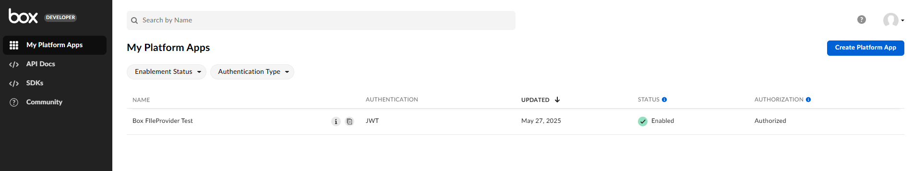
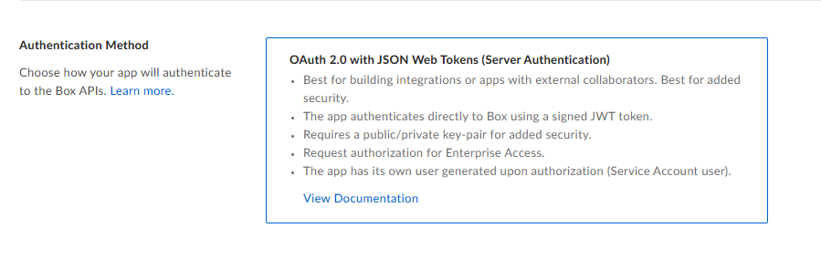
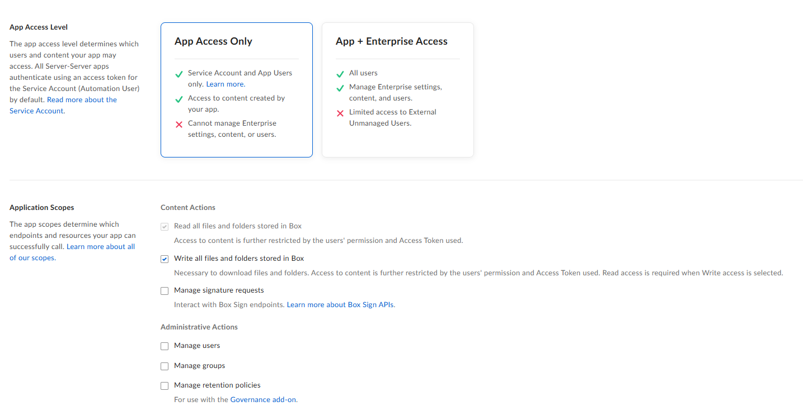
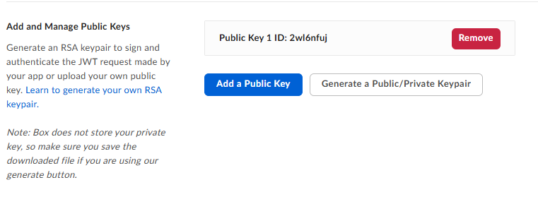

# Cloud File Storage Manager

Provides complete implementation to handle easily cloud file storage operations like get informations about files, reading, downloadURL generation, file update, file move and delete. Primarily for `Box` right now.

### Configuration

Let's add a section to the `appsettings.json`

```
"BoxStorageSettings": {
    "ClientId": "",
    "ClientSecret": "",
    "EnterpriseId": "",
    "PublicKeyId": "",
    "PrivateKey": "",
    "Passphrase": "",
    "RootFolderId": "0"
}
```
In the application, configure this settings part

```cs
services.AddSingleton<ICloudFileStorageManager, BoxFileStorageManager>(services => new BoxFileStorageManager(new BoxFileStorageManagerOptions()
{
    ClientId = config.GetSection("BoxStorageSettings").GetValue<string>("ClientId"),
    ClientSecret = config.GetSection("BoxStorageSettings").GetValue<string>("ClientSecret"),
    EnterpriseId = config.GetSection("BoxStorageSettings").GetValue<string>("EnterpriseId"),
    PublicKeyId = config.GetSection("BoxStorageSettings").GetValue<string>("PublicKeyId"),
    PrivateKey = config.GetSection("BoxStorageSettings").GetValue<string>("PrivateKey"),
    Passphrase = config.GetSection("BoxStorageSettings").GetValue<string>("Passphrase"),
    RootFolderId = config.GetSection("BoxStorageSettings").GetValue<string>("RootFolderId")
}));

```

## Images of the Box side configuration

Let's create a `Platform Application`



It is necessary to `Enable` the applicaiton and `Authorization` from administrators is required. After that, a service account is created for the Platform application with which the API interaction takes place.

`JWT` type application is recommended for this kind of use-cases



Minimal access is sufficient



Public/Private Keypair

A `Public/Private Keypair` is required for the necessary configuration, which can be created with the click of a button. A `config file` is also downloaded here, which contains all the necessary configuration data required for the configuration. (ClientId, Keys, etc.)



When using a Box Platform App with JWT authentication, your app acts as a service account, also called an App User. This service account is isolated from your personal Box account.

- Files and folders uploaded using JWT don't show up in "All Files" in your personal Box account — because they are not stored in your user’s root folder, but in the service account’s storage space.

Where did your files go?

If you're using JWT to authenticate via the platform app and then uploading files:
- The uploads are happening under the App User's account, not your personal Box user.
- Unless you explicitly upload to a folder owned/shared by a managed user (like yourself), it goes into the App User’s own root.
